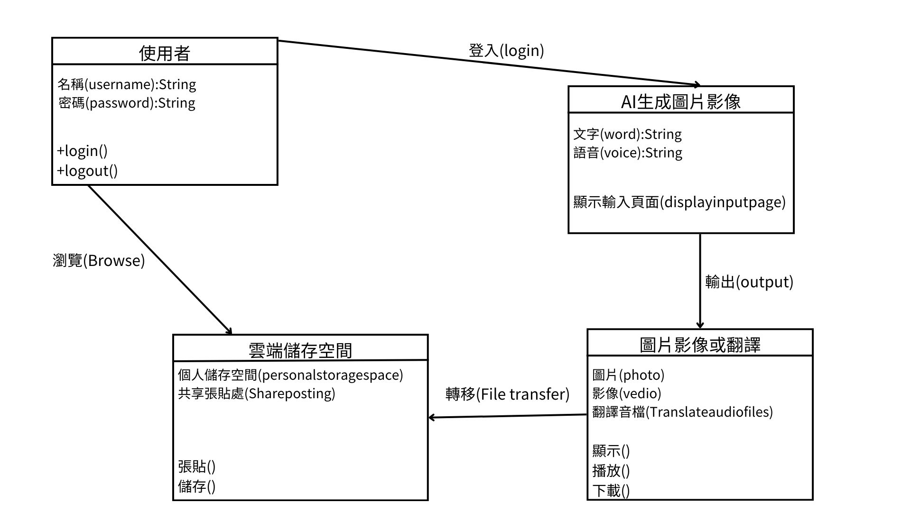
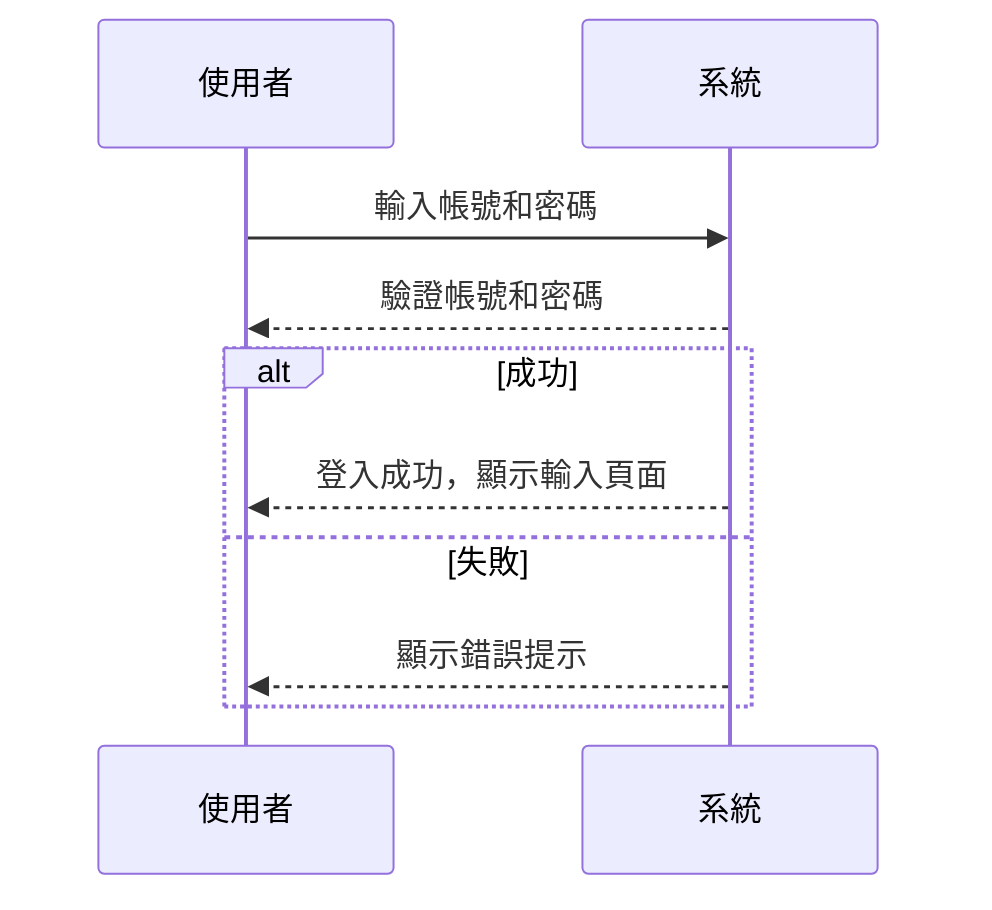
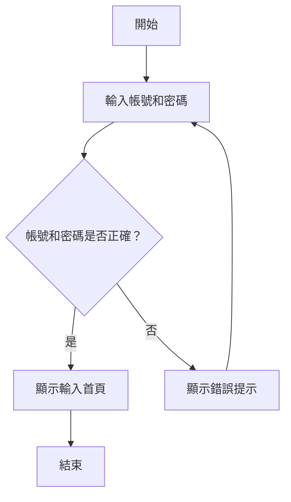
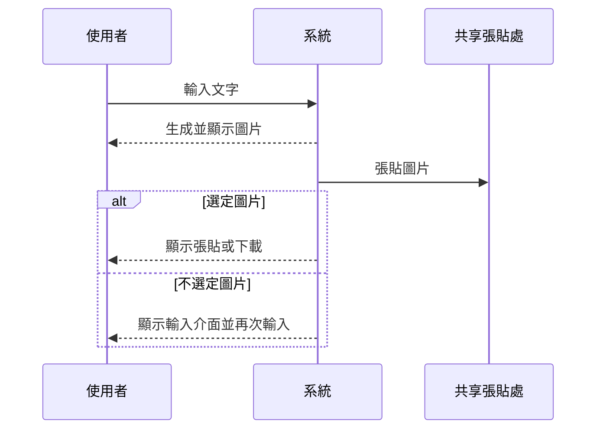
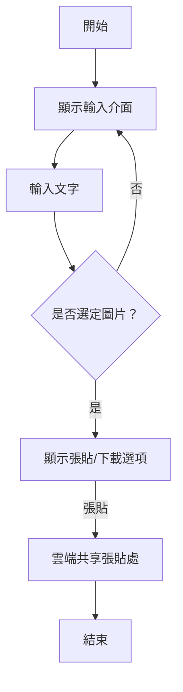
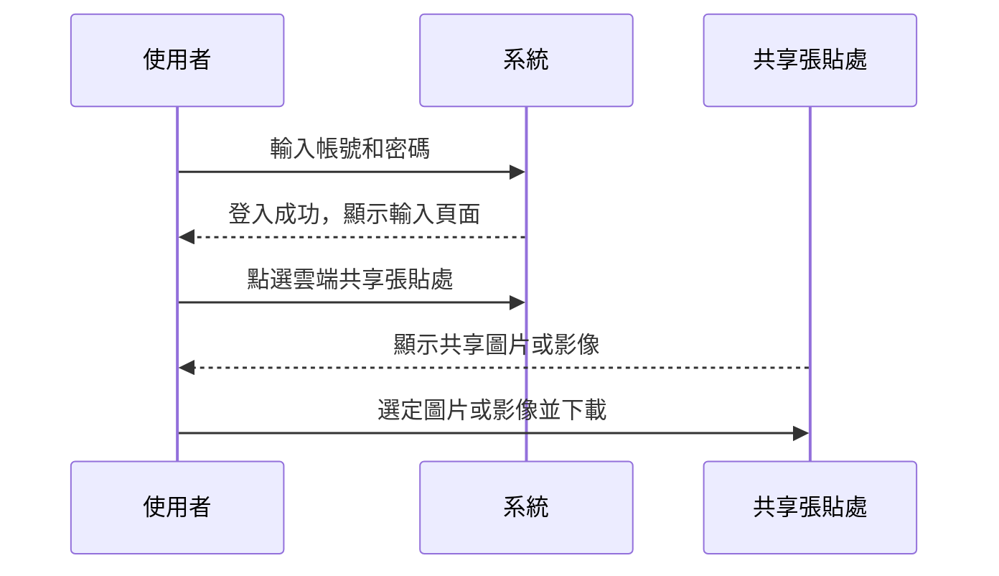
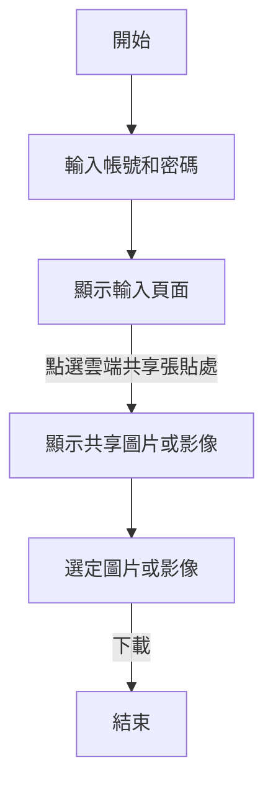

### 類別圖

## 使用案例 1：用戶註冊與登入
### 循序圖

```mermaid
sequenceDiagram
    participant User as 使用者
    participant System as 系統

    User->>System: 輸入帳號和密碼
    System-->>User: 驗證帳號和密碼
    alt 成功
        System-->>User: 登入成功，顯示輸入頁面
    else 失敗
        System-->>User: 顯示錯誤提示
    end
```
### 活動圖

```mermaid
flowchart TD
    A[開始] --> B[輸入帳號和密碼]
    B --> C{帳號和密碼是否正確？}
    C -- 是 --> D[顯示輸入首頁]
    C -- 否 --> E[顯示錯誤提示]
    E --> B
    D --> F[結束]
```

## 使用案例 2：ai圖片生成並張貼
### 循序圖

```mermaid
sequenceDiagram
    participant User as 使用者
    participant System as 系統
    participant Shareposting as 共享張貼處

    User->>System: 輸入文字
    System-->>User: 生成並顯示圖片
    System->>Shareposting: 張貼圖片
   
    alt 選定圖片
        System-->>User: 顯示張貼或下載
    else 不選定圖片
        System-->>User: 顯示輸入介面並再次輸入
    end
```
### 活動圖

```mermaid
flowchart TD
    A[開始] --> B[顯示輸入介面]
    B --> C[輸入文字]  
    C --> D{是否選定圖片？}
    D -- 是 --> E[顯示張貼/下載選項]
    D -- 否 --> B
    E -- 張貼 --> F[雲端共享張貼處]
    F --> G[結束]
```

## 使用案例 3：瀏覽張貼圖片或影像並下載
### 循序圖

```mermaid
sequenceDiagram
    participant User as 使用者
    participant System as 系統
    participant Shareposting as 共享張貼處

    User->>System: 輸入帳號和密碼
    System-->>User: 登入成功，顯示輸入頁面
    User->>System: 點選雲端共享張貼處
    Shareposting-->>User:顯示共享圖片或影像
    User->>Shareposting: 選定圖片或影像並下載
```

### 活動圖

```mermaid
flowchart TD
    A[開始] --> B[輸入帳號和密碼]
    B --> C[顯示輸入頁面]  
    C --點選雲端共享張貼處--> D[顯示共享圖片或影像]
    D --> E[選定圖片或影像]
    E -- 下載 --> F[結束]
  
```

