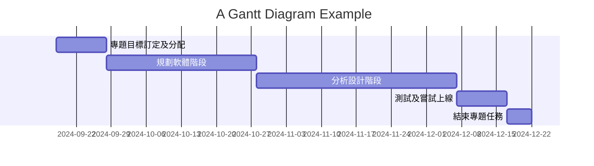
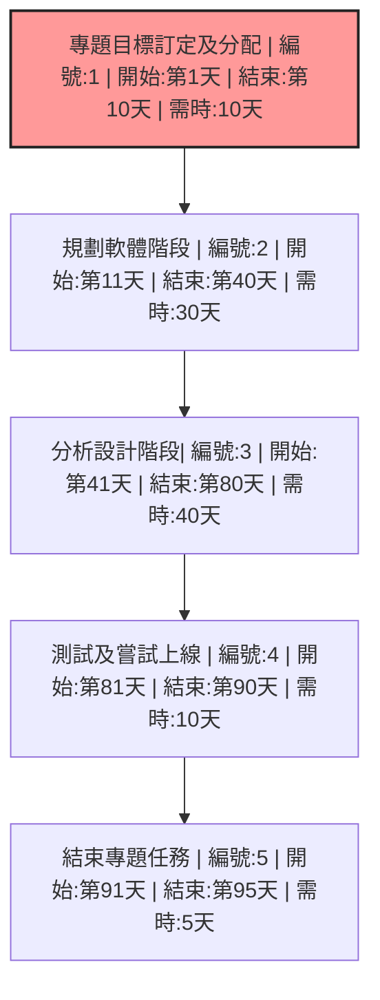
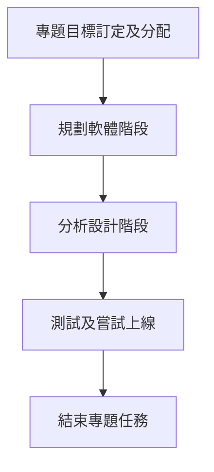

# 生成式ai整合平台及判讀反ai專案
組長 林羿伸 C111118107

組員 王俊昇 C111118146

組員 廖志軒 C111118137

專題內容概要：我們希望結合現有ai技術整合成一個平台或app，可以在平台生成影像影片和聲音或進行翻譯，且可以判讀多媒體內容是否為ai生成

```mermaid
gantt
    title A Gantt Diagram Example

    dateFormat  YYYY-MM-DD
    axisFormat  %Y-%m-%d

    專題目標訂定及分配   :a1, 2024-9-18, 10d
    規劃軟體階段         :a2, after a1, 30d
    分析設計階段           :a3, after a2, 40d

    測試及嘗試上線          :a4, after a3, 10d
    結束專題任務          :a5, after a4, 5d

    
```

```mermaid
   graph TD
    no1["專題目標訂定及分配 | 編號:1 | 開始:第1天 | 結束:第10天 | 需時:10天"] --> no2["規劃軟體階段 | 編號:2 | 開始:第11天 | 結束:第40天 | 需時:30天"]
    no2 --> no3["分析設計階段| 編號:3 | 開始:第41天 | 結束:第80天 | 需時:40天"]

    no3 --> no4["測試及嘗試上線 | 編號:4 | 開始:第81天 | 結束:第90天 | 需時:10天"]
    no4 --> no5["結束專題任務 | 編號:5 | 開始:第91天 | 結束:第95天 | 需時:5天"]

   
    style no1 fill:#ff9999,stroke:#222,stroke-width:2px
```

```mermaid
graph TD
    A["專題目標訂定及分配"] --> B["規劃軟體階段 "]
    B --> C["分析設計階段"]
    C --> D["測試及嘗試上線"]
    D --> E["結束專題任務"]
   
    
```

